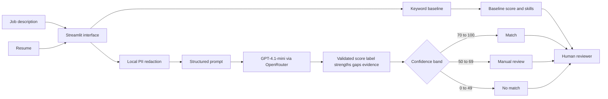

# Resume-JD Matching and Human Review Assistant

PE6201 Emerging AI Technologies course project by Han Haochen (Section C).

This reproducible Streamlit prototype compares a transparent keyword baseline
with one structured foundation-model call routed through OpenRouter. It helps a
human reviewer compare one job description with one resume; it does not make
hiring or rejection decisions.

## Product overview

**Persona.** Mei is a junior recruiter at a technology company. She reviews 40
to 60 resumes in a working day, uses standard office software, and has no
specialist AI knowledge. She needs a concise explanation of what matched, what
is missing, and which cases require closer human review.

**Inputs.** One pasted job description and one pasted resume. The demonstration
uses synthetic resume data only.

**Outputs.** A score from 0 to 100, a `MATCH`, `NO_MATCH`, or `MANUAL_REVIEW`
label, plus short strengths, gaps, and resume-grounded evidence. The keyword
baseline separately displays matched and missing skills.

## Headline result

| System | Strict accuracy | Qualified recall | Manual-review rate |
|---|---:|---:|---:|
| Majority-class baseline | 50% | 100% | 0% |
| Keyword baseline | 25% | 20% | 20% |
| LLM matcher | **75%** | **85%** | 25% |

Results are based on 40 held-out synthetic cases. The LLM issued no direct
`NO_MATCH` decision for a ground-truth qualified case; uncertain cases were
routed to `MANUAL_REVIEW`. See [`results/evaluation_report.md`](results/evaluation_report.md)
for definitions, interpretation and limitations.

## Intended use and scope

The app supports a human reviewer by comparing job-relevant evidence in one job
description and one resume. It must not automatically reject, rank or hire a
person. The prototype uses synthetic data and is intended only for coursework
demonstration.

## What it includes

- Streamlit user interface
- keyword-overlap baseline
- local redaction of common names, email addresses and phone numbers
- one OpenRouter API call with a validated structured output
- manual-review outcome for ambiguous cases
- automated tests for the baseline and redaction logic
- deterministic synthetic development and test cases
- reproducible evaluation metrics and CSV outputs

## Product architecture



The model compares supplied text only. No external retrieval or autonomous tool
loop is used. Deterministic code handles redaction, the baseline, validation,
thresholds, and evaluation.

## Quick start

Create a virtual environment and install the dependencies:

```bash
python3 -m venv .venv
source .venv/bin/activate
pip install -r requirements.txt
```

Start the application immediately; the keyword baseline works without an API
key:

```bash
python -m streamlit run app.py
```

For the AI comparison, copy `.env.example` to `.env`, then replace the example
value with an OpenRouter API key. Never commit `.env`. Existing local files that
use `OPENAI_API_KEY` are accepted as a compatibility alias when the key starts
with `sk-or-`.

```bash
cp .env.example .env
python -m streamlit run app.py
```

## Run tests

```bash
python -m pytest -q
```

## Generate data and evaluate

The synthetic data generator fixes each label before either system is evaluated:

```bash
python generate_dataset.py
python evaluate.py
```

After the API key and provider are confirmed, run the AI comparison as well:

```bash
python evaluate.py --include-ai
```

The outputs are written to `results/predictions.csv` and `results/summary.json`.

The current held-out run is summarized in `results/evaluation_report.md`. On 40
synthetic test cases, the LLM matcher achieved 75% strict accuracy versus 25% for
the keyword baseline and 50% for the majority-class baseline. These figures are
course evidence only and do not establish real-world hiring validity.

## Metrics targeted and reached

| Metric | Target | Reached | Interpretation |
|---|---:|---:|---|
| Strict accuracy | At least 75% in the final scoped plan | 75% | Target met on the synthetic test |
| Initial proposal accuracy | At least 82% | 75% | Initial stretch target not met |
| Direct false rejection of qualified cases | 0 | 0 | Three uncertain qualified cases went to manual review |
| Qualified-candidate recall | Report transparently | 85% | 17 of 20 received a direct match |
| Manual-review rate | Report transparently | 25% | 10 of 40 cases required a person |

The initial 82% proposal target was set before the dataset and abstention policy
were finalised. The final scoped target was reduced to 75%. Both targets are
shown to avoid presenting the observed result as if it had been the only target.

## Current limits

- The baseline recognizes only the fixed skill vocabulary in `baseline.py`.
- Redaction covers common direct identifiers but is not production-grade.
- The prototype accepts pasted text only.
- Results are decision support, not hiring decisions.
- The synthetic dataset covers only one junior data-analyst role and cannot establish
  production hiring validity.

## Repository guide

- `app.py` - Streamlit interface
- `matcher.py` - PII redaction and structured OpenRouter call
- `baseline.py` - transparent keyword baseline
- `generate_dataset.py` - deterministic synthetic data generator
- `evaluate.py` - baseline and LLM evaluation
- `data/cases.csv` - 20 development and 40 held-out test cases
- `data/README.md` - data scope, schema, generation and limitations
- `results/` - predictions, metrics and evaluation report
- `results/README.md` - evaluation design, metric definitions and commands
- `docs/` - final problem statement, analysis and demo script
- `tests/` - automated checks for baseline, metrics and redaction
- `prompt.txt` - versioned system prompt

## Submission documents

- [`docs/problem_statement.md`](docs/problem_statement.md) - final problem statement
- [`docs/analysis.md`](docs/analysis.md) - final report and outcome critique
- [`data/README.md`](data/README.md) - dataset explainer
- [`results/README.md`](results/README.md) - evaluation explainer
